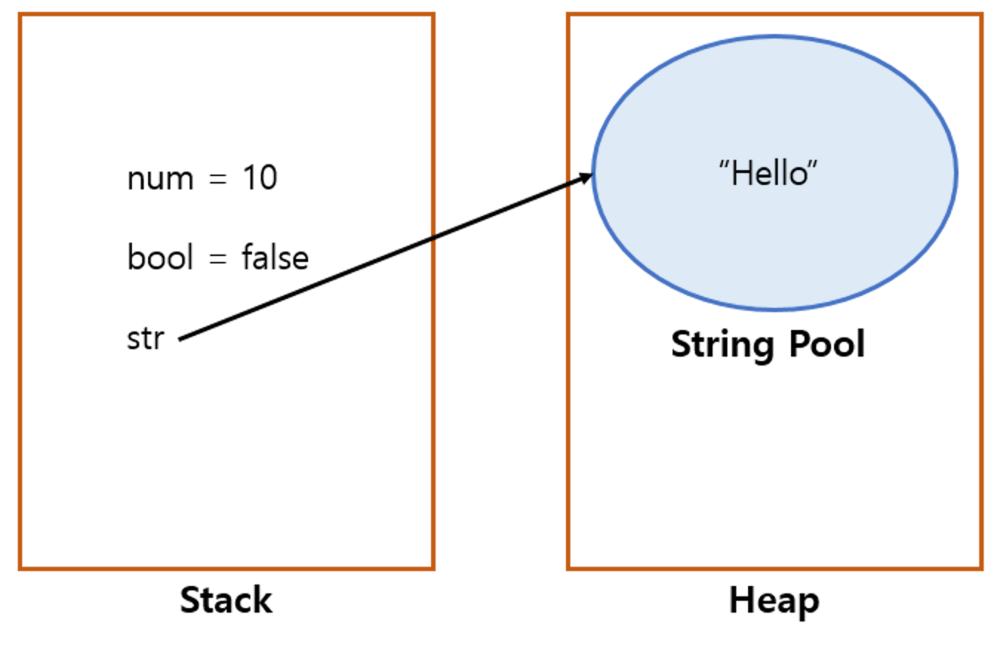
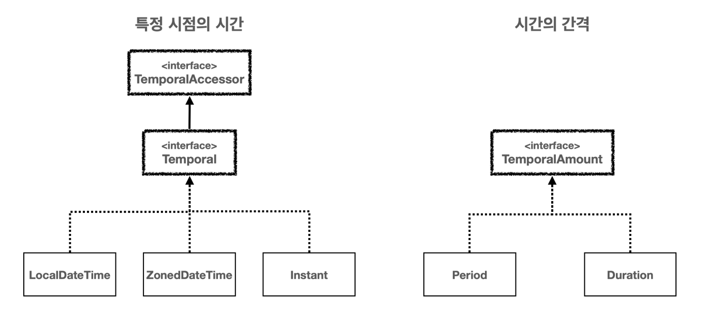
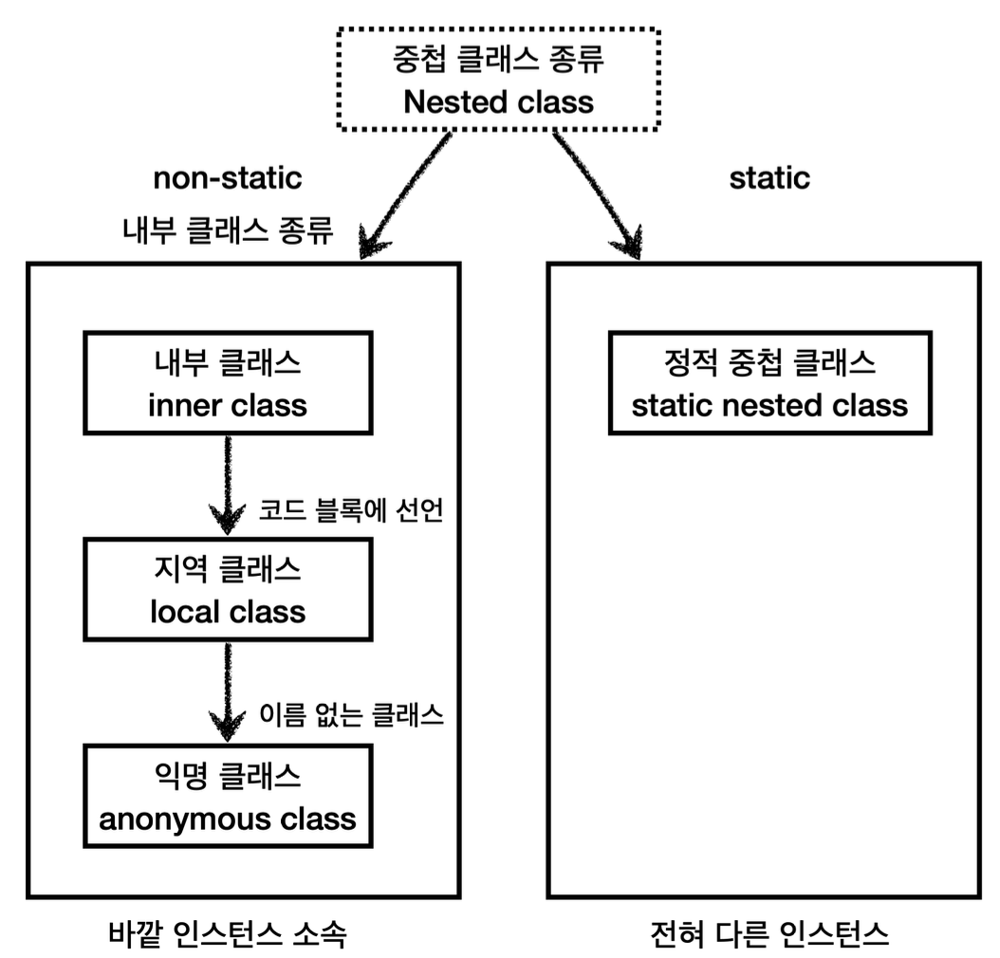
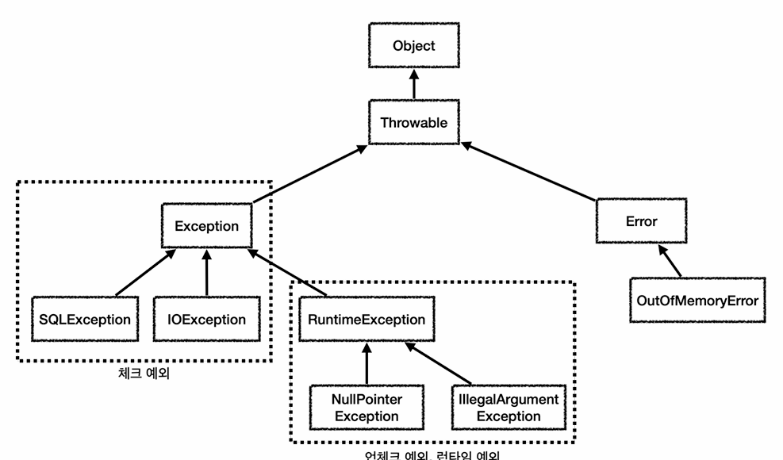

# 자바 중급 공부-1

<br>

## java.lang
자바가 기본으로 제공하는 라이브러리 중에 가장 기본이 되는 것이 `java.lang` 패키지다  
자바 언어를 이루는 가장 기본이 되는 클래스들을 보관

<br>

### java.lang 패키지의 대표적인 클래스들
- `Object`: 모든 자바 객체의 부모 클래스
- `String`: 문자열
- `Integer`, `Long`, `Double`: 래퍼 타입, 기본형 데이터 타입을 객체로 만든 것
- `Class`: 클래스 메타 정보
- `System`: 시스템과 관련된 기본 기능들을 제공

<br>

> `java.lang` 패키지는 모든 자바 애플리케이션에 자동으로 임포트된다. 따라서 임포트 구문을 사용하지 않아도 됨

<br><br><br><br><br><br>

## Object 클래스
- 자바에서 **모든 클래스의 최상위 부모 클래스**
  - 공통기능 제공
    - toString(), equals(), getClass() 등등...
  - 다형성의 기본 구현
    - 모든 클래스의 부모 클래스이다. 따라서 모든 객체를 참조할 수 있다
- 클래스에 상속받을 부모 클래스가 없으면 묵시적으로 `Object` 클래스를 상속받는다

<br>
묵시적: 개발자가 코드에 직접 기술하지 않아도 시스템 또는 컴파일러에 의해 자동으로 수행<br>
명시적: 개발자가 코드에 직접 기술해서 작동하는 것

### Object 다형성의 한계 
- object로 객체를 받았을때, object는 최상위 부모이므로 자식을 불러낼 수 없다
- 그럴때 다음과 같이 다운캐스팅을 해야한다
```
        if (obj instanceof Dog dog) {
            dog.sound();
        } 
```

### Object 활용
- 모든 객체를 받을 수 있는 메서드, 배열을 만들 수 있다

### toString()
```java
public String toString() {
        return getClass().getName() + "@" + Integer.toHexString(hashCode());
}
```
- `object`가 제공하는 `toString()` 메서드는 기본적으로 패키지를 포함한 객체의 이름과 객체의 참조값(해시코드)을 16진수로 제공

<br>

```java
        Object o = new Object();
        String string = o.toString();

        // tostring 반환값 출력
        System.out.println(string);

        // object 직접 출력
        System.out.println(o);
```
- 두 결과값이 같게 나온다
- `Object`타입 인수로 전달되면 `println()`메서드 내부에서 `toString()`메서드를 호출해 주기 때문

### toString() 오버라이딩
- 보통 toString()을 재정의 해서 보다 유용한 정보를 제공하는 것이 일반적
- 자식이 오버라이딩 해서 참조값을 알 수 없다면?
  - ```java
        // 이렇게 참조값을 알아낼 수 있다
        String refValue = Integer.toHexString(System.identityHashCode(dog1));
        System.out.println(refValue);
    ```
    
### OCP 원칙
- **Open**: 새로운 클래스를 추가하고, `toString()`을 오버라이딩해서 기능을 확장할 수 있다
- **Closed**: 새로운 클래스를 추가해도 `Object`와 `toString()`을 사용하는 클라이언트 코드인 `ObjectPrinter`는 변경하지 않아도 됨

### System.out.println()
- `System.out.println()` 메서드도 `Object` 매개변수를 사용하고 내부에서 `toString()`을 호출

<br>

정적 의존관계: 컴파일 시간에 결정되며, 주로 클래스 간의 관계를 의미<br>
동적 의존관계: 프로그램을 실행하는 런타임에 확인할 수 있는 의존관계

### equals()
- **동일성**: `==`연산자를 사용해서 두 객체의 참조가 동일한 객체인지 확인
- **동등성**: `equals()`메서드를 사용하여 두 객체가 논리적으로 동등한지 확인
- 동등성 비교를 사용하고 싶으면 `equals()`메서드를 재정의 해야 한다.
- 그렇지 않으면 동일성 비교를 기본으로 제공

<br>

> 동등성을 비교하는 메서드는 `Objects.equals(a, b)`가 있다

<br><br><br><br><br><br>

## 불변 객체

<br>

_**사이드 이펙트**: 프로그래밍에서 어떤 계산이 주된 작업 외에 추가적이 부수 효과를 일으키는 것_<br>
- 사이트 이펙트는 의도치 않게 다른 부분에 영향을 미치는 경우 발생
- 이로 인해 **디버깅이 어려워지고 코드의 안정성 저하**

<br>

#### 공유 참조와 사이드 이펙트 
- 객체의 공유가 필요할 때도 있지만, 때로는 공유하는 것이 사이드 이펙트를 만드는 경우도 있다
- **참조값의 공유를 막을 수 있는 방법이 없다**
- 문제를 해결하기 위해 **불변 객체**를 만들면 된다

<br>

### 불변 객체
- 객체의 상태가 변하지 않는 객체를 불변 객체라 한다
- 필드를 `final`로 선언, `set()`메서드 제거하면 됨
- 불변 객체의 값을 변경하고 싶을때 새로운 객체를 생성해서 꼭 반환값을 받는다
- `String`, `Integer`, `LocalDate` 등 불변으로 설계되어 있다

<br>

클래스를 불변으로 설계하는 이유
- 캐시 안정성
- 멀티 쓰레드 안정성
- 엔티티의 값 타입

<br><br><br><br><br><br>

## String, Class 클래스

<br>

#### `String` 클래스를 통해 문자열 생성하는 방법
> 쌍따옴표 사용: **"hello"**  
> 객체 생성: **new String("hello");**

<br>

- String은 클래스다. 기본형이 아닌 참조형이다
- 따라서 다음 코드는 어색하다
```java
String str = "hello";
```
- 문자열은 자주 사용하기 때문에 자바 언어에서 편의상 `new String("hello")`와 같이 변경해 준다
- 실제로 성능 최적화를 위해 문자열 풀 사용

### String 클래스 구조 
```
public final class String { 

  //문자열 보관
  private final char[] value;// 자바 9 이전
  private final byte[] value;// 자바 9 이후
  
  //여러 메서드
  public String concat(String str) {...}
  public int length() {...}
  ...
}
```
- `String` 문자열은 내부에서 `char[]`에 보관된다
- 자바 9부터 `String` 클래스에서 `char[]`대신 `byte[]` 사용
  - 메모리를 더 효율적으로 사용하기 위해

### String 클래스와 참조형
```
        String a = "hello";
        String b = " java";

        String result1 = a.concat(b);
        String result2 = a + b;
        System.out.println("result1 = " + result1);
        System.out.println("result2 = " + result2);
```
- 참조형은 원칙적으로 `+`같은 연산을 사용할 수 없다
- 하지만 `String`은 참조형이라도 너무 자주 다루어져서 자바에서 편의상 특별히 `+` 연산 제공

### 문자열 리터럴, 문자열 풀

- `String str = "hello"`는 `String str = new String("hello")`와 달리 메모리 효율성과 성능 최적화를 위해 문자열 풀을 사용한다
- 문자열 리터럴은 문자열 객체 생성과 달리 문자열 풀 사용
```
String str3 = "hello";
String str4 = "hello";
```
- str3, str4은 문자열 풀에서 "hello"라는 문자를 가진 `String`인스턴스를 찾고 참조를 반환한다
- str3, str4 모두 같은 문자열 리터럴을 사용하므로 참조값이 같다
- 따라서 str3과 str4는 동일성이 같다

<br>

> 풀(Pool)은 자원이 모여있는 곳을 의미한다. 프로그래밍에서 풀(Pool)은 공용 자원을 모아둔 곳을 뜻한다

> 문자열 풀에서 문자를 찾을 때는 해시 알고리즘을 사용하기 때문에 매우 빠른 속도로 원하는 `String`인스턴스를 찾을 수 있다

<br>

### String - 불변 객체
- String은 불변 객체이다.
- 따라서 String은 생성 이후에 절대로 내부의 문자열 값을 변경할 수 없다
- 불변 `String` 클래스의 단점은 문자를 더하거나 변경할 때 마다 계속해서 새로운 객체를 생성해야 한다는 점이다
- 그럴수록 GC해야 헤서 시스템의 자원을 많이 소모하게 됨

### StringBuilder - 가변 String
- 위의 문제를 해결하기 위해 자바는 `StringBuilder`라는 가변 `String`을 제공
  - 사용시 사이드 이팩트에 주의하자

### String 최적화
- 문자열을 합칠 때 대부분의 경우 최적화가 되므로 `+`연산을 사용하면 된다

**StringBuilder를 직접 사용하는 것이 더 좋은 경우**
- 반복문에서 반복해서 문자를 연결할 때
- 조건문을 통해 동적으로 문자열을 조합할 때
- 복잡한 문자열의 특정 부분을 변경해야 할 때
- 매우 긴 대용량 문자열을 다룰 때

<br>

> `StringBuffer`는 내부에 동기화 되어 있어서, 멀티 스레드 상황에서 안정하지만 동기화 오버헤드로 인해 성능이 느리다
> `StringBuilder`는 멀티 쓰레드에 상황에 안전하지 않지만 동기화 오버헤드가 없으므로 속도가 빠르다

<br>

### 메서드 체인닝
- 메서드를 호출하면 인스턴스 자신의 참조값을 반환한다
- 이 반환된 참조값을 즉시 사용해서 바로 메서드를 호출할 수 있다
```java
ValueAdder valueAdder = new ValueAdder();
int result = valueAdder.add(1).add(2).add(3).getValue();
```
- 코드가 `.`을 찍고 메서드를 계속 연결해서 사용한다
- 이러한 기법을 메서드 체이닝이라 한다
- **메서드 체이닝 기법은 코드를 간결하고 읽기 쉽게 만들어준다**

<br>

#### StringBuilder와 메서드 체인
- `StringBuilder`는 메서드 체이닝 기법을 제공

<br><br><br><br><br><br>

## 래퍼 클래스
- 특정 기본형을 감싸서 만드는 클래스를 래퍼 클래스라 한다

<br>

### 기본형의 한계
- 기본형은 객체가 아니라서 객체 지향 프로그래밍의 장점을 살릴 수 없다
  - 컬렉션 프레임워크, 제네릭을 사용할 수 없다
- 기본형은 `null` 값을 가질 수 없다

### 자바 래퍼 클래스
- 자바가 제공하는 래퍼 클래스는 불변이다
- equals로 비교해야 한다
- **박싱**: 기본형을 래퍼 클래스로 변경하는 것을 박싱이라고 한다
  - `Integer.valueOf(10)`을 사용하면 된다
  - 개발자들이 자주 사용하는 -128~127 범위의 `Integer`클래스를 미리 생성해준다. 해당 범위의 값이 없으면 `new Integer()` 호출
- **언박싱**: 래퍼 클래스에 들어있는 기본형 값을 다시 꺼내는 메서드

### 오토 박싱, 오토 언박싱
- 컴파일러가 개발자 대신 `valueOf`, `xxxValue` 등의 코드를 추가해주는 기능
- 기본형과 래퍼형을 서로 편리하게 변환할 수 있다

### 래퍼 클래스 성능
- 기본형 연산이 래퍼 클래스보다 몇 배이상 빠르다
- 기본형은 4바이트 메모리 사용
- 래퍼 클래스는 기본형 값 뿐만 아니라 대략 8-16바이트의 메모리를 추가로 사용
- 그런데 일반적인 애플리케이션을 만드는 관점에서 보면 이런 부분을 최적화해도 별 차이 안난다
- CPU 연산 많이 수행, 수십~수십만 이상 연속 연산 수행의 경우 기본형 사용
- 그렇지 않으면 유지보수 하기 더 좋은 것 선택

### Class 클래스
- `Class`클래스는 클래스의 정보를 다루는데 사용된다
- **타입 정보 얻기**: 클래스 이름, 슈퍼클래스, 인터페이스 접근제한자 등
- **리플랙션**: 클래스에 정의된 메소드, 필드, 생성자 등 조화, 이를 통한 인스턴스 생성, 메서드 호출
- **동적 로딩과 생성**: 클래스 동적 로드, newInstance()로 인스턴스 생성
- **어노테이션 처리**: 어노테이션 조회 및 처리

<br><br><br><br><br><br>

## 열거형 -ENUM

<br>

### 문자열과 타입 안전성
- 문자열은 오타가 발생하기 쉽고, 유효하지 않는 값이 입력될 수 있다 -> 컴파일시 감지X
- 데이터 일관성이 떨어진다
- 상수로 타입 안전성을 확보하기 애매한 부분이 있다

### 타입 안전 열거형 패턴
- 클래스를 정의해서 클래스 타입만 쓸 수 있게 하고, 쓸 수 있는 항목만 객체 생성해서 상수에 담는다
- 클래스의 기본생성자 추가
- 장점: 타입 안전성 향상, 데이터 일관성
- 단점: 많은 코드 작성

### 열거형 - ENUM 타입 
- `enum`: 열거라는 뜻으로, 어떤 항목을 나열하는 것
- 상수들의 집합을 정의하는 것
- 열거형을 정의할 때는 `class`대신 `enum`을 사용한다
- 장점: 타입 안전성 향상, 간결성 및 일관성, 확장성

### ENUM 주요 메서드
- values(): 모든 ENUM 상수를 포함하는 배열을 반환
- valueOf(String name): 주어진 이름과 일치하는 ENUM 상수를 반환
- name(): ENUM 상수의 이름을 문자열로 반환
- ordinal(): ENUM 상수의 선언 순서를 반환
- toString(): ENUM 상수의 이름을 문자열로 반환

<br>

> ordinal()은 가급적 사용하지 않는 것이 좋다. 중간에 상수를 선언하는 위치가 변경되면 전체 상수 위치가 변경되기 때문

<br><br><br><br><br><br>

## 날짜와 시간

<br>

### LocalDate, LocalTime, LocalDateTime
- LocalDate: 년,월,일을 다룬다. 예) `2020-11-11`
- LocalTime: 시,분,초를 다룬다. 예) `08:20:30.213`
- LocalDateTime: LocalDate + LocalTime 예) `2020-11-11T08:20:30.213`

### ZonedDateTime, OffsetDateTime
- ZonedDateTime: 시간대를 고려한 날짜와 시간을 표현할 때 사용
  - 예) `2020-11-11T08:20:30.213+9:00[Asia/Seoul]`
  - 일광 절약 시간제가 적용
- OffestDateTime: 시간대를 고려한 날짜와 시간을 표현할 때 사용
  - 예) `2020-11-11T08:20:30.213+9:00`
  - 일광 절약 시간제가 적용되지 않음
- `ZonedDateTime`은 구체적인 지역 시간대를 다룰 때 사용하며, 일광 절약 시간을 자동으로 처리할 수 있다
- `OffsetDateTime`은 UTC와의 시간 차이만 나타낼 때 사용하며, 지역 시간대의 복잡성을 고려하지 않는다

### Year, Month, YearMonth, MonthDay
- 년, 월, 년월, 달일을 각각 다룰 때 사용한다
- `DayOfWeek`와 같이 월,화,수,목,금,토,일을 나타내는 클래스도 있다

### Instant
- `UTC`를 기준으로 하는, 시간의 한 지점을 나타낸다
- 날짜와 시간을 나노초 정밀도로 표현하며, 1970년 1월 1일 0시 0분 0초를 기준으로 경과한 시간으로 계산된다
- Instance 내부에는 초 데이터만 들어있다

<br>

> Epoch 시간은 컴퓨터 시스템에서 시간을 나타내는 방법 중 하나다
> `Instant`는 Epoch 시간을 다루는 클래스다

<br>

### Period, Duration
- Period: 두 날짜 사이의 간격을 년,월,일 단위로 나타낸다
- Duration: 두 날짜 사이의 간격을 시,분,초 단위로 나타낸다

### 날짜와 시간 인터페이스

- 특정 시점의 시간: `Temporal`(`TemperalAccessor` 포함) 인터페이스 구현
  - `LocalDateTime`, `ZonedDateTime`, `OffsetDateTime`, `Instant`
- 시간의 간격: `TemporalAmount` 인터페이스 구현
  - `Period`, `Duration`
- 시간의 단위를 뜻하는 인터페이스: `TemporalUnit (ChronoUnit)`
- 시간의 각 필드를 뜻하는 인터페이스: `TemporalField`

### TemporalAccessor.get(TemporalField field)
- ex) `dt.get(ChronoField.YEAR)` or 편의 메서드`dt.getYear()`
- 날짜와 시간을 조회한다

### Temporal plus(long amountToAdd, TemporalUnit unit)
- ex) `dt.plus(10, ChronoUnit.YEARS)` or 편의 메서드 `dt.plusYear(10)`
- 특정 시점의 시간을 더할 수 있다

### TemporalAdjuster
- Tmeporal.with()는 단순한 날짜 변경
- TemporalAdjuster는 복잡한 날자 계산을 하여 날짜를 변경
  - `ex)`
  - TemporalAdjusters.next(DayOfWeek.FRIDAY) : 다음 금요일을 구한다.
  - TemporalAdjusters.lastInMonth(DayOfWeek.SUNDAY) : 이번 달의 마지막 일요일을 구한다

<br><br><br><br><br><br>

## 중첩 클래스
- 중첩 클래스: 클래스를 중첩해서 정의하는 것

<br>

### 중첩 클래스의 분류

- 정적 중첩 클래스 - static
- 내부 클래스 종류 - non-static
  - 내부 클래스 (인스턴스와 같은 위치)
  - 지역 클래스 (지역변수와 같은 위치)
  - 익명 클래스 (지역 클래스의 특별한 버전)

<br>

- **중첩**: 어떤 다른 것이 내부에 위치하거나 포함되는 구조적인 관계
- **내부**: 나의 내부에 있는 나를 구성하는 요소

__정적 중첩 클래스는 바깥 클래스와 전혀 다른 클래스고, 내부클래스는 바깥 클래스를 구성하는 요소다__

<br>

> 실무에서는 중첩클래스, 내부클래스룰 구분하지 않고 말한다

<br>

### 중첩 클래스가 사용될 때
- 중첩 클래스는 특정 클래스가 다른 하나의 클래스 안에서만 사용되거나, 둘이 아주 긴밀하게 연결되어 있는 특별한 경우에만 사용

### 정적 중첩 클래스
- 자신의 멤버에는 접근할 수 있다
- 바깥 클래스의 인스턴스 멤버에는 접근할 수 없다
- 바깥 클래스의 클래스 멤버에는 접할 수 있다
  - 바깥 클래스의 `private` 접근 제어자에 접근할 수 있다

### 내부 클래스
- 자신의 멤버에는 접근할 수 있다
- 바깥 클래스의 인스턴스 멤버에 접근할 수 있다
- 바깥 클래스의 클래스 멤버에 접근할 수 있다
  - 내부 클래스는 바깥 클래스의 `private`접근 제어자에 접근할 수 있다
- 내부 인스턴스는 바깥 인스턴스의 참조를 보관한다.
  - 참조를 통해 바깥 인스턴스의 멤버에 접근할 수 있다

### 지역 클래스
- 코드 블럭 안에 클래스를 선언
- 지역 클래스는 지역 변수에 접근할 수 있다
- 자신의 인스턴스 변수, 지역변수, 매개변수, 바깥 클래스의 멤버 모두 접근할 수 있다
- 지역 클래스는 지역 변수처럼 접근 제어자를 사용할 수 없다

### 지역 변수 캡쳐
- 지역 클래스를 통해 생성한 인스턴스가 지역 변수에 접근해야 하는데, 둘의 생명 주기가 다르다
- 이 문제를 해결하기 위해 지역 클래스의 인스턴스를 생성하는 시점에 필요한 지역변수를 복사해서 인스턴스에 넣어둔다
- 이 과정을 변수 캡쳐라 한다
- 지역 클래스가 접근하는 지역 변수는 절대로 중간에 값이 변하면 안된다
- 따라서 `final`로 선언해야 한다 -> 동기화 문제 때문

### 익명 클래스
- 지역클래스의 종류 중 하나로 클래스 이름이 없다
- 클래스 선언과 객체생성을 한번에 한다
- 클래스를 정의하지 않아도 인터페이스를 구현할 수 있어 코드가 간편하다

<br>

> `String`, `int`같은 데이터를 전달할때 매개변수로 전달하면 된다  
> 코드 조각을 메서드에 전달할때 인스턴스로 전달한다

<br>

### 람다
- 메서드를 인수로 전달할 수 있게 함

<br><br><br><br><br><br>

## 예외 처리

<br>

### 예외 처리가 필요한 이유
- 정상 흐름과 예외 흐름을 명확하게 분리할 수 있다

### 예외 계층


>`Object`: 예외의 최상위 부모  
>`Throwable`: 최상위 예외. 하위에 `Exception`, `Error`가 있다  
>`Error`: 애플리케이션에서 복구가 불가능한 예외  
>`Exception`: 애플리케이션에서 사용할 수 있는 최상위 예외

#### 체크예외 vs 언체크 예외 
- `RuntimeException`: 컴파일러가 체크 하지 않는 언체크 예외(런타임 예외)
- 체크 예외는 개발자가 직접 처리해야하고, 언체크는 개발자가 예외를 예외처리 안해도 된다

#### throw, throws
- `throw`는 새로운 예외를 발생시킬 수 있다. `new`키워드로 생성해서 예외를 발생시킨다
- `throws`는 예외를 던질때 사용하는 키워드다

### 체크예외
- 예외클래스를 만들려면 예외를 상속받으면 된다
- `Exception`을 상속받은 예외는 체크예외가 된다
### throw, throws
- `throw`는 새로운 예외를 발생시킬 수 있다. `new`키워드로 생성해서 예외를 발생시킨다 -> 폭탄 터트리기
- `throws`는 예외를 던질때 사용하는 키워드다 -> 밖으로 던지기

<br>

### 체크예외
- 예외클래스를 만들려면 예외를 상속받으면 된다
- `Exception`을 상속받은 예외는 체크예외가 된다
- 예외는 오류메세지를 보관하는 기능이 있다
  - throwable의 디테일 메세지에 메세지들이 있다
  - `getMessage()`를 통해 조회할 수 있다

### try-catch
```
try {

} catch (Exception x) {

}
```
- 체크 예외를 잡아서 `catch`로 처리하는 코드다
  - 만약 `try`에서 잡은 예외가 `catch` 대상에 없으면 예외를 잡을 수 없다

### 던지는 체크
- 예외를 잡아서 처리하지 못하면 `main()` 밖으로 던져진다
  - 때문에 예외처리 이후의 코드들은 실행되지 않는다
- 예외가 `main()`밖으로 던져지면 스택 트레이스를 출력하고 프로그램 종료
  - 스택 트레이스: 예외가 어디서 발생했는지, 어떤 경로를 거쳐서 넘어왔는지 확인

<br>

### 언체크예외
- `RuntimeException`, 그 하위 예외는 상속받으면 언체크 예외가  된다
- `throws`를 사용하지 않아도 된다 -> 체크예외와 큰 차이점
  - 컴파일러가 이런 부분을 체크하지 않아서 언체크 예외

### 공통 예외 처리
- 시스템 오류로 발생한 예외는 해결할 수 있는게 거의 없다. 잡아도 같은 오류가 반복된다.
- 처리할 수 없는 예외가 많아지고, 체크 예외 사용이 부담
- 언체크예외로 `exceptionHandler(e)`에 예외를 한곳에 모아 공통 예외 처리를 한다
- `e.printStackTrace()`로 스택 트레이스 출력